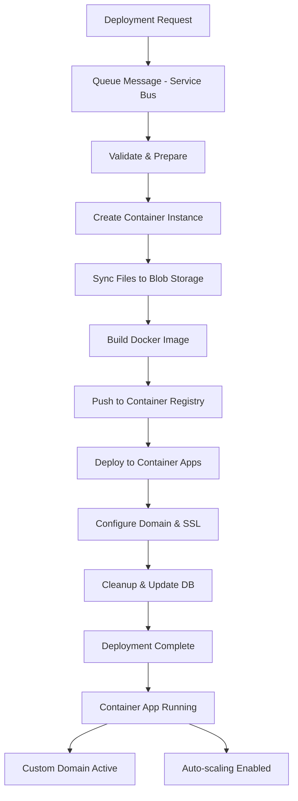

# 🚀 Libra Deploy V3 - Azure Deployment Service

A modern, Azure-native deployment service for the Libra platform, built for **Azure Container Apps** with comprehensive cloud integration.

## 📋 Overview

Deploy V3 replaces the previous Cloudflare-based deployment services with a fully Azure-integrated solution that provides:

- **Azure Container Apps** hosting (replaces Cloudflare Workers)
- **Azure Service Bus** message queuing (replaces Cloudflare Queues)
- **Azure Blob Storage** for artifacts and logs (replaces R2)
- **Azure Cosmos DB** for deployment state (replaces D1)
- **Azure Container Registry** for Docker images
- **Azure Key Vault** for secure configuration

## 🏗️ Architecture

```
┌─────────────────────────────────────────────────────────────────┐
│                         Deploy V3 Architecture                  │
├─────────────────────────────────────────────────────────────────┤
│                                                                 │
│  HTTP API     ┌─────────────┐    Azure Service Bus             │
│  ────────────►│   Deploy    │────────────────────────────────► │
│               │     API     │                                  │
│               └─────────────┘                                  │
│                      │                                         │
│                      ▼                                         │
│               ┌─────────────┐    Azure Cosmos DB               │
│               │    State    │────────────────────────────────► │
│               │   Manager   │                                  │
│               └─────────────┘                                  │
│                      │                                         │
│                      ▼                                         │
│               ┌─────────────┐                                  │
│               │  Deployment │                                  │
│               │  Workflow   │                                  │
│               └─────────────┘                                  │
│                      │                                         │
│              ┌───────┼───────┐                                 │
│              ▼       ▼       ▼                                 │
│    ┌──────────────┬────────────┬─────────────────┐             │
│    │ Container    │ Docker     │ Container Apps  │             │
│    │ Instance     │ Build      │ Deployment      │             │
│    │ (Build)      │ & Push     │ (Production)    │             │
│    └──────────────┴────────────┴─────────────────┘             │
│           │              │              │                      │
│           ▼              ▼              ▼                      │
│    ┌────────────┬────────────────┬───────────────┐             │
│    │ Azure      │ Container      │ Container     │             │
│    │ Storage    │ Registry       │ Apps          │             │
│    │ (Blobs)    │ (Images)       │ (Runtime)     │             │
│    └────────────┴────────────────┴───────────────┘             │
│                                                                 │
└─────────────────────────────────────────────────────────────────┘
```

## 🔧 Deployment Workflow

### 6-Step Deployment Process

1. **Validate & Prepare** - Validate permissions and Azure resources
2. **Container Instance** - Create build environment in Azure Container Instances
3. **Sync Files** - Upload project files to Azure Blob Storage
4. **Build & Push** - Build Docker image and push to Container Registry
5. **Deploy** - Deploy to Azure Container Apps with auto-scaling
6. **Cleanup** - Clean up temporary resources and update database

### Deployment Flow



## ⚡ Quick Start

### Prerequisites

- **Azure Account** with active subscription
- **Azure CLI** installed and authenticated
- **Node.js 20+** and **Bun** installed
- **Docker** for local testing

### 1. Environment Setup

```bash
# Clone repository
cd apps/deploy-azure

# Copy environment template
cp .env.example .env

# Install dependencies
bun install
```

### 2. Configure Azure Resources

```bash
# Login to Azure
az login

# Set subscription
az account set --subscription "your-subscription-id"

# Create resource group
az group create --name libra-resources --location eastus

# Create Container Registry
az acr create --resource-group libra-resources \
  --name libraregistry --sku Basic

# Create Service Bus namespace
az servicebus namespace create --resource-group libra-resources \
  --name libra-servicebus --location eastus

# Create queue
az servicebus queue create --resource-group libra-resources \
  --namespace-name libra-servicebus --name deployment-queue

# Create storage account
az storage account create --resource-group libra-resources \
  --name librastorage --location eastus --sku Standard_LRS

# Create Cosmos DB account
az cosmosdb create --resource-group libra-resources \
  --name libra-cosmos --default-consistency-level Eventual

# Create Key Vault
az keyvault create --resource-group libra-resources \
  --name libra-keyvault --location eastus
```

### 3. Configure Environment Variables

Edit `.env` with your Azure resource details:

```bash
# Azure Configuration
AZURE_SUBSCRIPTION_ID=your-subscription-id
AZURE_TENANT_ID=your-tenant-id
AZURE_RESOURCE_GROUP=libra-resources
AZURE_LOCATION=eastus

# Service Principal (for production)
AZURE_CLIENT_ID=your-client-id
AZURE_CLIENT_SECRET=your-client-secret

# Azure Services
AZURE_CONTAINER_REGISTRY=libraregistry
AZURE_SERVICE_BUS_CONNECTION_STRING="Endpoint=sb://..."
AZURE_STORAGE_CONNECTION_STRING="DefaultEndpointsProtocol=https;..."
AZURE_COSMOS_CONNECTION_STRING="AccountEndpoint=https://..."
AZURE_KEY_VAULT_URI=https://libra-keyvault.vault.azure.net/
```

### 4. Development

```bash
# Start development server
bun dev

# Run with Docker Compose (includes local emulators)
docker-compose up -d

# Test deployment
curl -X POST http://localhost:3010/deploy \
  -H "Content-Type: application/json" \
  -d '{
    "projectId": "test-project",
    "userId": "user123",
    "organizationId": "org456",
    "projectName": "Test App",
    "environment": "development"
  }'
```

## 📡 API Reference

### Deploy Endpoints

| Method | Endpoint | Description |
|--------|----------|-------------|
| `POST` | `/deploy` | Queue new deployment |
| `GET` | `/deploy/:id/status` | Get deployment status |
| `GET` | `/deploy/:id/logs` | Get deployment logs |
| `POST` | `/deploy/:id/cancel` | Cancel deployment |
| `POST` | `/deploy/:id/retry` | Retry failed deployment |
| `GET` | `/deploy/project/:id` | List project deployments |

### Health & Status

| Method | Endpoint | Description |
|--------|----------|-------------|
| `GET` | `/health` | Basic health check |
| `GET` | `/health/detailed` | Detailed health with dependencies |
| `GET` | `/health/ready` | Readiness probe |
| `GET` | `/health/live` | Liveness probe |
| `GET` | `/status` | Service statistics |
| `GET` | `/status/queue` | Queue metrics |

### Example Deployment Request

```json
{
  "projectId": "my-app",
  "userId": "user_123",
  "organizationId": "org_456",
  "projectName": "My Application",
  "environment": "production",
  "customDomain": "myapp.com",
  "containerSize": {
    "cpu": "1",
    "memory": "2Gi"
  },
  "envVariables": {
    "DATABASE_URL": "postgres://...",
    "API_KEY": "secret123"
  },
  "buildCommand": "npm run build",
  "startCommand": "npm start"
}
```

### Example Response

```json
{
  "success": true,
  "deploymentId": "dep_7N3K8L2M5Q9",
  "status": "queued",
  "message": "Deployment queued successfully",
  "estimatedDuration": "5-10 minutes"
}
```

## 🔐 Security & Authentication

### Azure Authentication

The service supports multiple authentication methods:

1. **Managed Identity** (Production - Recommended)
2. **Service Principal** (CI/CD)
3. **Azure CLI** (Development)

### Key Vault Integration

Sensitive configuration is stored in Azure Key Vault:

```typescript
import { createConfigManager } from './utils/azure-auth'

const config = createConfigManager()

// Get secret with fallback to environment
const dbPassword = await config.getRequiredConfig(
  'DATABASE_PASSWORD',
  'database-password' // Key Vault secret name
)
```

### Deployment Isolation

- Each deployment runs in isolated **Azure Container Instance**
- Build artifacts stored in separate blob containers
- Container Apps use **managed identity** for secure access
- Network security groups control traffic

## 🔧 Configuration

### Environment Variables

| Variable | Description | Required |
|----------|-------------|----------|
| `AZURE_SUBSCRIPTION_ID` | Azure subscription ID | ✅ |
| `AZURE_RESOURCE_GROUP` | Resource group name | ✅ |
| `AZURE_CONTAINER_REGISTRY` | Container registry name | ✅ |
| `AZURE_SERVICE_BUS_CONNECTION_STRING` | Service Bus connection | ✅ |
| `AZURE_STORAGE_CONNECTION_STRING` | Storage account connection | ✅ |
| `AZURE_COSMOS_CONNECTION_STRING` | Cosmos DB connection | ✅ |
| `AZURE_KEY_VAULT_URI` | Key Vault URI | ✅ |
| `MAX_CONCURRENT_DEPLOYMENTS` | Max concurrent deployments | ❌ |
| `DEPLOYMENT_TIMEOUT_MS` | Deployment timeout | ❌ |
| `BUILD_CONTAINER_CPU` | Build container CPU | ❌ |
| `BUILD_CONTAINER_MEMORY` | Build container memory | ❌ |

### Container Apps Configuration

```typescript
// Environment-specific settings
const configs = {
  development: {
    minReplicas: 0,
    maxReplicas: 2,
    cpu: '0.5',
    memory: '1Gi'
  },
  production: {
    minReplicas: 2,
    maxReplicas: 10,
    cpu: '2',
    memory: '4Gi'
  }
}
```

### Auto-scaling Rules

```yaml
scale:
  minReplicas: 1
  maxReplicas: 10
  rules:
    - name: http-scaling
      http:
        metadata:
          concurrentRequests: '100'
    - name: cpu-scaling
      custom:
        type: cpu
        metadata:
          type: Utilization
          value: '70'
```

## 🚀 Deployment Options

### Development Deployment

```bash
# Local development with emulators
bun dev

# Local Docker environment
docker-compose up -d

# Deploy to Azure development environment
bun run azure:deploy:dev
```

### Production Deployment

```bash
# Build production image
bun run build

# Deploy to Azure Container Apps
bun run azure:deploy:prod

# Or use GitHub Actions
git push origin main  # Triggers deployment pipeline
```

### Infrastructure as Code

Use the provided Terraform configuration:

```bash
cd infrastructure/terraform

# Initialize Terraform
terraform init

# Plan deployment
terraform plan -var-file="prod.tfvars"

# Apply infrastructure
terraform apply -var-file="prod.tfvars"
```

## 📊 Monitoring & Observability

### Application Insights

Integrated with **Azure Application Insights** for:

- Request tracing and performance monitoring
- Custom deployment metrics
- Error tracking and alerts
- Dependency mapping

### Custom Metrics

```typescript
// Track deployment metrics
logger.info('Deployment completed', {
  deploymentId,
  duration: Date.now() - startTime,
  projectId: params.projectId,
  environment: params.environment,
  // Custom properties for Application Insights
  customDimensions: {
    containerSize: params.containerSize,
    hasCustomDomain: !!params.customDomain
  }
})
```

### Health Checks

Multiple health check endpoints:

- `/health` - Basic service health
- `/health/detailed` - Dependency health status
- `/health/ready` - Kubernetes readiness probe
- `/health/live` - Kubernetes liveness probe

## 🔄 Migration from V2

### API Compatibility

Deploy V3 maintains backward compatibility with V2:

```bash
# V2 endpoint (legacy)
POST /api/deploy

# V3 endpoint (new)
POST /deploy
```

### Response Format

Both endpoints return the same response structure:

```json
{
  "success": true,
  "deploymentId": "...",
  "message": "...",
  "status": "queued"
}
```

### Migration Steps

1. **Deploy V3 in parallel** with V2
2. **Feature flag** to route traffic to V3
3. **Monitor metrics** for both services
4. **Gradually migrate** projects to V3
5. **Deprecate V2** once migration is complete

## 🛠️ Development

### Project Structure

```
src/
├── api/                 # HTTP API routes
│   ├── deployment.ts    # Deployment endpoints
│   ├── health.ts        # Health checks
│   └── status.ts        # Status and metrics
├── deployment/          # Deployment workflow
│   ├── workflow.ts      # Main orchestrator
│   └── steps/           # Individual deployment steps
├── queue/               # Azure Service Bus integration
│   ├── consumer.ts      # Message consumer
│   └── producer.ts      # Message producer
├── storage/             # Data persistence
│   └── state-manager.ts # Cosmos DB state management
├── types/               # TypeScript definitions
├── utils/               # Utility functions
│   ├── azure-auth.ts    # Authentication & Key Vault
│   ├── azure-config.ts  # Azure configuration
│   └── logger.ts        # Structured logging
└── index.ts             # Application entry point
```

### Testing

```bash
# Run type checking
bun run typecheck

# Run unit tests
bun run test

# Run tests with coverage
bun run test:coverage

# Integration tests with Docker
docker-compose -f docker-compose.test.yml up --build
```

### Code Quality

```bash
# Format code (using Biome)
bun run format

# Lint code
bun run lint

# Fix linting issues
bun run lint:fix
```

## 🚨 Troubleshooting

### Common Issues

**Authentication Errors**
```bash
# Verify Azure login
az account show

# Check managed identity
curl -H "Metadata: true" \
  "http://169.254.169.254/metadata/identity/oauth2/token?api-version=2018-02-01&resource=https://management.azure.com/"
```

**Deployment Failures**
```bash
# Check deployment logs
curl http://localhost:3010/deploy/:deploymentId/logs

# Check container instance logs
az container logs --resource-group libra-resources --name build-container-xyz

# Check service bus dead letter queue
az servicebus queue show --resource-group libra-resources \
  --namespace-name libra-servicebus --name deployment-dlq
```

**Performance Issues**
```bash
# Check queue metrics
curl http://localhost:3010/status/queue

# Monitor container apps
az containerapp logs show --name myapp --resource-group libra-resources

# Check Application Insights
az monitor app-insights query --app myapp-insights \
  --analytics-query "requests | where timestamp > ago(1h)"
```

## 📄 License

AGPL-3.0-only - See [LICENSE](../../LICENSE) file for details.

## 🤝 Contributing

1. Fork the repository
2. Create feature branch (`git checkout -b feature/azure-deploy-v3`)
3. Make changes and add tests
4. Run quality checks (`bun run typecheck && bun run test`)
5. Commit changes (`git commit -m 'feat: add azure container apps support'`)
6. Push branch (`git push origin feature/azure-deploy-v3`)
7. Create Pull Request

---

**🎉 Azure Deploy V3 - Built for the cloud, designed for scale.**